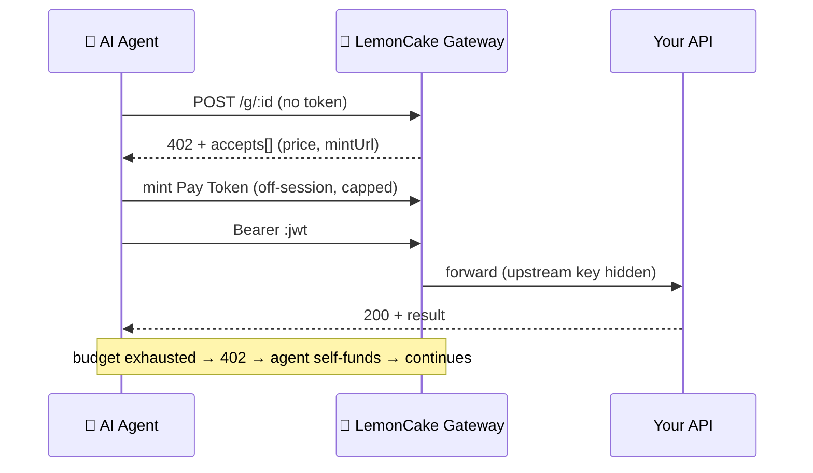

<div align="center">

# 🍋 LemonCake

**The billing, budget & identity layer for software for agents.** `Private Beta · Open core`

*Monetize any MCP/API in minutes, and let AI agents pay for it safely — each agent gets a spend-capped identity (budget, usage, pause/revoke). Buyers pay by card; **no crypto wallet**.*
*First 3,000 calls free (lifetime). Then 3% only when your API earns.*

[-green.svg)](LICENSE)
[](#-open-core)
[](https://modelcontextprotocol.io)
[](https://x402.org)
[](https://www.npmjs.com/package/agent-payment-mcp)
[](https://lemoncake.xyz/security)
[](https://glama.ai/mcp/servers/evidai/lemon-cake)

**[🚀 Get started](#-get-started) · [💲 Pricing](https://lemoncake.xyz/pricing) · [📚 Docs](https://lemoncake.xyz/docs) · [🌐 Live](https://lemoncake.xyz)**

<br>


<sub>☝️ A real AI agent buys API calls by itself ($0.01 each), stops at its cap, and the API owner earns — no human, no crypto. · <a href="https://github.com/evidai/agent-unleashed">demo source</a></sub>

</div>

---

## 🚀 Get started

**Monetizing an MCP/API? Start here — one command:**

```bash
npx create-lemon-mcp my-paid-mcp     # a paid MCP server, running in sandbox now
# then add a Seller Key in /app and set LEMONCAKE_SELLER_KEY → it charges for real (no code change)
```

Pick your path:

| I want to… | Do this |
|---|---|
| **Monetize my MCP/API** (sellers) | **`npx create-lemon-mcp`** → add a Seller Key in [/app](https://lemoncake.xyz/app) to go live |
| Add billing to a server I **already have** | [`@lemon-cake/mcp-sdk`](https://www.npmjs.com/package/@lemon-cake/mcp-sdk) — wrap a tool with `lc.charge()`, or route through the gateway (no code) |
| **Let an agent pay** for paid APIs (buyers) | `npx -y agent-payment-mcp` — 8 free demo tools, no signup |

<details>
<summary>Buyer-side MCP — try in 30 seconds</summary>

```bash
npx -y agent-payment-mcp
```
```json
{ "mcpServers": { "lemon": { "command": "npx", "args": ["-y", "agent-payment-mcp"] } } }
```
Ask your agent to run `list_demos` / `call_demo`. To call **paid** APIs, set `LC_PAY_TOKEN` (get one at [lemoncake.xyz/app](https://lemoncake.xyz/app)).

</details>

---

## What is LemonCake?

LemonCake is an **x402 payment rail** for monetizing MCP servers and HTTP APIs. Sellers register an endpoint and set a price per call. Buyers prepay by card and receive a spend-capped Pay Token. Agents call the gateway with that token, and LemonCake verifies, meters, forwards, and records usage.



**Sellers** register any HTTP API and set a price per call.
**Buyers / agents** prepay with a card → Pay Token issued automatically → agent calls the API within budget.
Budget exhausted → 402 challenge → agent self-funds → continues. No humans.

---

## 🧱 Open core

| Layer | Status | Where |
|---|---|---|
| Buyer-side MCP (`agent-payment-mcp`) | ✅ MIT | [npm](https://www.npmjs.com/package/agent-payment-mcp), [src](./mcp-server) |
| Seller SDK (`@lemon-cake/mcp-sdk`) | ✅ MIT | [npm](https://www.npmjs.com/package/@lemon-cake/mcp-sdk), [src](./lemoncake-mcp-sdk) |
| Starter templates | ✅ MIT | [examples/](./examples) |
| Docs site | ✅ Public | [lemoncake.xyz/docs](https://lemoncake.xyz/docs) |
| **Gateway + billing engine** | 🔒 Hosted | lemoncake.xyz |
| **Dashboard** (analytics, usage ledger) | 🔒 Hosted | lemoncake.xyz/app |

---

## 💳 How payment works

### For buyers (human or agent)

1. Open a **buy link** (`lemoncake.xyz/buy/<shortId>`)
2. Pay with a card → **Pay Token (JWT) issued automatically**
3. Pass `Authorization: Bearer <token>` to the gateway
4. Gateway verifies, meters, forwards to the real API
5. Budget exhausted → 402 challenge returned with payment instructions

### For agents (fully autonomous)

1. Issue a **Buyer Key** (`bk_...`) at [/app](https://lemoncake.xyz/app) → Pay Tokens pane
2. Save a card once at [/agent/fund](https://lemoncake.xyz/agent/fund)
3. Agent calls `POST /api/lc/agent/tokens` (Bearer bk_) → off-session card charge → JWT
4. Agent uses JWT to call gateway — **hard-capped, no human in the loop**

```json
// MCP config for agent with pre-issued Pay Token
{
  "mcpServers": {
    "lemon": {
      "command": "npx",
      "args": ["-y", "agent-payment-mcp"],
      "env": {
        "LC_PAY_TOKEN": "<jwt from Pay Token>"
      }
    }
  }
}
```

---

## 🏗 Publish your API on LemonCake (sellers)

Monetize any HTTP API or MCP server:

1. Sign in at [lemoncake.xyz/app](https://lemoncake.xyz/app)
2. **Add API** — paste your URL, set price per call (e.g. `$0.01`)
3. Share the **buy link**, or issue a **Seller Key** (`sk_live_…`) to charge from your own server
4. **You keep 97%.** LemonCake takes 3% (Stripe Connect Direct Charge). Never holds funds.

**Scaffold a paid MCP in one command** — sandbox by default, production with one env var:

```bash
npx create-lemon-mcp my-paid-mcp     # demo runs with no key
# then: set LEMONCAKE_SELLER_KEY=sk_live_… → it charges for real (no code change)
```

Add billing to any tool with the SDK ([`@lemon-cake/mcp-sdk`](https://www.npmjs.com/package/@lemon-cake/mcp-sdk) v1, no crypto):

```typescript
import { createLemonCakeSDK } from "@lemon-cake/mcp-sdk";

const lc = createLemonCakeSDK();   // reads LEMONCAKE_SELLER_KEY (demo without it)

server.tool("my_premium_tool", "desc", { q: z.string() },
  lc.charge({ price: 0.01 })(async ({ q }) => {
    return { content: [{ type: "text", text: "result" }] };
  }),
);
```

`lc.charge` wraps the handler: preflight (reserve) → run → settle (confirm on success, refund on failure). Or route existing traffic through `https://lemoncake.xyz/g/<shortId>` — **no code changes required**.

---

## 🪪 Agent Identity

Give each AI agent its own spend-capped identity — so a fleet can pay for APIs without a shared card or runaway cost. Built on top of Pay Tokens; **no balance pool, custody-free** (an agent's "budget" is just the Pay Tokens bound to it).

- **Bind a Pay Token to an agent** when issuing it (`agentId`) → spend is attributed to that agent.
- **Per-agent rollup** — budget, spend, calls, last-used in the dashboard.
- **Kill switch** — `pause` / `resume` / `revoke` an agent; bound tokens are rejected at the gateway instantly (`AGENT_PAUSED` / `AGENT_REVOKED`), even with budget remaining.
- **Server-authoritative** — price is set on the endpoint; agents never carry a card or a seller key.

```bash
# manage agents (owner-authenticated)
POST /api/agents            # create  → { agent_id, ... }
POST /api/agents/:id/pause  # kill switch (also /resume, /revoke)
GET  /api/agents            # list + per-agent spend rollup
```

---

## ✨ Features

### For agents / buyers
- ✅ **x402 native** — 402 challenge returns `accepts[]` with price + mintUrl
- ✅ **Hard-capped** — per-mint / daily / monthly limits, server-enforced
- ✅ **Off-session top-up** — agent self-funds via Buyer Key (`bk_...`), no prompts
- ✅ **Demo Mode** — 8 free tools, try without any setup

### For API providers / sellers
- ✅ **5-min go-live** — `npx create-lemon-mcp`, or `lc.charge()` on any tool, or route through the gateway
- ✅ **Custody-free** — Stripe Connect Direct Charge, 97% goes directly to seller
- ✅ **Usage ledger** — every call recorded, revenue visible in dashboard
- ✅ **Buy link** — share one URL, buyers self-serve

### For agent fleets / operators
- ✅ **Per-agent identity** — bind Pay Tokens to an agent, attribute spend
- ✅ **Per-agent kill switch** — pause / resume / revoke, enforced at the gateway
- ✅ **Spend rollup** — budget / spent / calls per agent
- ✅ **No balance pool** — custody-free; budget = the agent's bound Pay Tokens

### Infrastructure
- 🔧 Stripe Connect Direct Charge (no custody)
- 🔧 x402 gateway with `WWW-Authenticate: Lemoncake-Prepaid`
- 🔧 EN / 日本語 / Español dashboard
- 🔧 [JP FSA: registration not required](https://lemoncake.xyz/security) (confirmed 2026-06)

---

## 🏗 Architecture

```
┌─────────────────────────────────────────────────┐
│  Buyer / Agent                                  │
│   ↳ prepays via card OR Buyer Key (bk_...)      │
│   ↳ receives Pay Token (signed JWT)             │
└──────────────────────┬──────────────────────────┘
                       │  Authorization: Bearer <jwt>
                       ▼
┌─────────────────────────────────────────────────┐
│  LemonCake Gateway  /g/<shortId>                │
│   ↳ verify JWT signature                        │
│   ↳ check budget + calls + rate limit           │
│   ↳ decrement spend, write to ledger            │
└──────────────────────┬──────────────────────────┘
                       │  HTTPS + upstream_auth (hidden)
                       ▼
┌─────────────────────────────────────────────────┐
│  Your API / MCP server (unchanged)              │
└─────────────────────────────────────────────────┘
```

LemonCake is the middle box. It never holds funds — money flows Stripe → seller via Direct Charge.

---

## 🌍 Compliance

Japan FSA Fintech Support Desk (2026-06) confirmed: no registration required.
Custody-free design (Stripe Connect Direct Charge, no pooled balance).

| Jurisdiction | Basis |
|---|---|
| 🇯🇵 Japan | FSA — registration not required |
| 🇺🇸 USA | FinCEN 2019 §4.5 — non-custodial software ≠ MSB |
| 🇪🇺 EU | MiCA — non-CASP |
| 🇬🇧 UK | FCA — Tech Service Provider |
| 🇸🇬 Singapore | MAS — DPT non-applicable |
| 🇨🇦 Canada | FINTRAC — non-custodial exemption |
| 🇨🇭 Switzerland | FINMA — non-financial intermediary |

See [lemoncake.xyz/security](https://lemoncake.xyz/security)

---

## 🔌 Package family

| Package | What it does |
|---|---|
| [`agent-payment-mcp`](https://www.npmjs.com/package/agent-payment-mcp) | Main entry — x402 gateway + agent payment rail |
| [`@lemon-cake/mcp-sdk`](https://www.npmjs.com/package/@lemon-cake/mcp-sdk) | Seller SDK — `lc.charge()` / `lc.protect()`, fiat, no crypto |
| [`create-lemon-mcp`](https://www.npmjs.com/package/create-lemon-mcp) | Scaffold a paid MCP server — sandbox→prod with one env var |
| [`xstocks-mcp`](https://www.npmjs.com/package/xstocks-mcp) | Buy tokenized US stocks on Solana |
| [`alpaca-guard-mcp`](https://www.npmjs.com/package/alpaca-guard-mcp) | Alpaca paper / live trading with hard daily cap |
| [`tokenized-stock-mcp`](https://www.npmjs.com/package/tokenized-stock-mcp) | Dinari dShares |

---

## 🛡 Security

- **Server-side hard caps** — per-mint / daily / monthly, cannot be exceeded
- **Pay Token = signed JWT** — HS256, verified on every gateway call
- **upstream_auth never exposed** — seller's real API key hidden from buyers
- **RLS on all DB tables** — Supabase row-level security enabled
- **Stripe Connect Direct Charge** — LemonCake never holds funds
